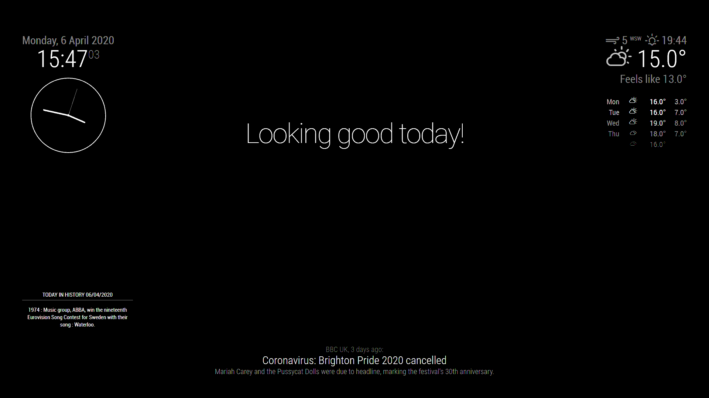

# MagicMirrorConfig

A basic config for magic mirror with some instructions on usage which should show a mirror similar to this:

## Screenshot



##Installation and Usage
To use,
<ol>
<li>
install MagicMirror2 using instructions from https://docs.magicmirror.builders/getting-started/installation.html, 
</li>
  <li>
    note where you have installed the magicmirror to and its actual name, all commands are case sensitive, the default is in your home directory
  </li>
  <li>
    cd to the install directory >> cd ~/MagicMirror or cd ~/magicmirror
  </li>
  <li>
    cd to the config directory >> cd config/
  </li>
  <li>
    install this config: >> git clone https://github.com/TheBodger/MagicMirrorConfig
  </li>
  <li>
    run  command to backup the existing config and replace it with the one just installed >> ./setup.sh
  </li>
  <li>
    make sure that you have also installed these modules for the full effect:
  </li>
  <ul>
  <li>https://github.com/cowboysdude/MMM-History and followed the instructions to install it</li>
  </ul>
</ol>  

to install and setup this config for your magic mirror use these commands (copy and paste into your terminal window on the PI)

```bash
cd ~/MagicMirror/config/
git clone https://github.com/TheBodger/MagicMirrorConfig
cd MagicMirrorConfig/
sudo chmod +x setup.sh
sudo chmod +x revert.sh
./setup.sh
```

to revert to the saved config, use these commands

```bash
cd ~/MagicMirror/config/MagicMirrorConfig/
./revert.sh
```
